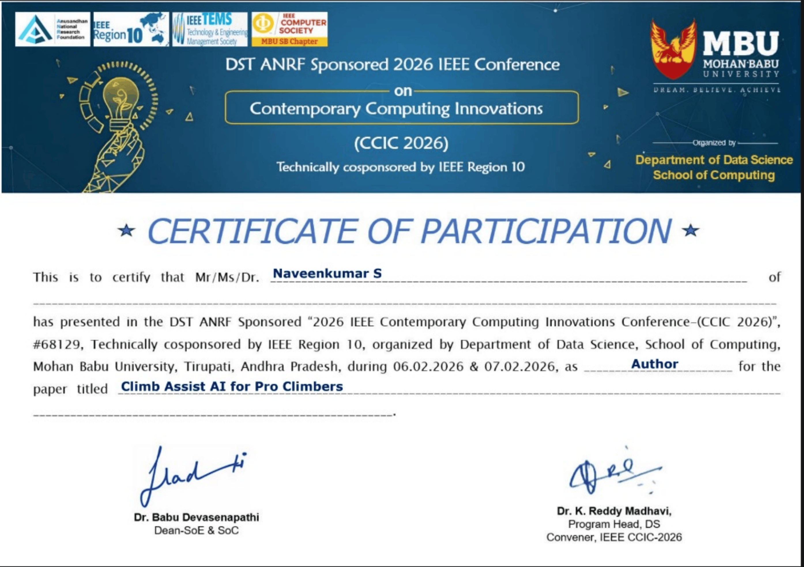

<div align="center">

# 🧗 ClimbAssist AI
### An Artificial Intelligence-Based Climbing Assistant for Advanced Athletes

[](https://ieeexplore.ieee.org/document/11486216)


**Final Year Research Project**

**Published in IEEE Xplore**

---

## 🏅 IEEE Conference Participation Certificate

**Author:** **Naveenkumar S**

This project was presented at the **2026 IEEE Contemporary Computing Innovations Conference (CCIC 2026)**, technically co-sponsored by **IEEE Region 10**, where I participated as an **Author** for the paper **"An Artificial Intelligence-Based Climbing Assistant for Advanced Athletes."**

<p align="center">
  
</p>

<p align="center">
📄 <a href="./assets/CCIC_participants_certificate.pdf">Download / View Full Certificate (PDF)</a>
</p>

---

# Overview

ClimbAssist AI is an AI-powered climbing analysis system designed to help climbers improve their performance through computer vision, biomechanical analysis, and Generative AI.

The system analyzes climbing videos using Google's **MoveNet Thunder** pose estimation model to extract human skeletal keypoints and calculate climbing-specific motion metrics. These metrics are interpreted by **Gemini AI**, which generates personalized coaching recommendations focused on climbing efficiency, posture correction, movement quality, and safety.

In addition to movement analysis, the system includes an intelligent gear recommendation module that suggests climbing equipment based on environmental conditions such as weather, terrain type, climbing location, and user experience.

This repository contains the implementation developed as part of our undergraduate research project, which was later published in IEEE Xplore.

---

# 📄 IEEE Publication

**Paper Title**

> **An Artificial Intelligence-Based Climbing Assistant for Advanced Athletes**

**Publication:** IEEE Xplore Digital Library

🔗 **Read the Published Paper:** [View on IEEE Xplore](https://ieeexplore.ieee.org/document/11486216)

---

# Authors

- Vivekrabinson K
- Bhuvanan P
- **Naveenkumar S**
- Venkatasudhan AR
- Thranesh B
- Bharath Singh J

Department of Computer Science and Engineering

Kalasalingam Academy of Research and Education

---

# Research Abstract

ClimbAssist AI combines lightweight pose estimation with Generative AI to provide automated climbing analysis and personalized coaching.

The system processes uploaded climbing videos using Google's MoveNet Thunder model to estimate body keypoints and compute biomechanical movement features including:

- Vertical displacement
- Joint variability
- Pose confidence
- Movement efficiency
- Stability metrics

These quantitative features are summarized using Gemini AI into human-readable coaching feedback covering:

- Posture improvement
- Hip positioning
- Foot placement
- Balance
- Movement efficiency
- Safety recommendations

The framework also recommends climbing equipment based on environmental context such as weather conditions, climbing terrain, rock type, and user skill level.

---

# Key Features

## AI Pose Estimation

- MoveNet Thunder Pose Estimation
- 17 Human Body Keypoints
- Real-time skeletal tracking
- Lightweight inference

## Motion Analysis

- Vertical movement tracking
- Joint stability analysis
- Hand variability measurement
- Hip trajectory analysis
- Pose confidence estimation

## AI Coaching Assistant

Powered by Gemini AI for:

- Personalized climbing feedback
- Technique improvement
- Performance recommendations
- Safety suggestions
- Training guidance

## Gear Recommendation

Environment-aware equipment recommendation based on:

- Weather
- Rock type
- Terrain
- Location
- Experience level

## Interactive Dashboard

- Video upload
- Motion visualization
- Pose keypoints
- AI-generated coaching insights
- Equipment recommendations

---

# System Workflow

```
Climbing Video
        │
        ▼
Video Preprocessing
        │
        ▼
MoveNet Thunder
Pose Estimation
        │
        ▼
17 Skeletal Keypoints
        │
        ▼
Motion Feature Extraction
        │
        ▼
Biomechanical Analysis
        │
        ▼
Gemini AI
        │
        ▼
Personalized Coaching Feedback
```

---

# Technology Stack

| Category | Technology |
|-----------|------------|
| Programming Language | Python |
| UI | Streamlit |
| Computer Vision | OpenCV |
| Pose Estimation | Google MoveNet Thunder |
| AI | Google Gemini |
| Deep Learning | TensorFlow |
| Data Processing | NumPy |
| Visualization | Matplotlib |

---

# Motion Metrics

The system computes several biomechanical measurements including:

- Vertical displacement
- Joint variability
- Pose confidence
- Hand stability
- Hip alignment
- Movement efficiency
- Climbing progression

---

# AI Coaching Insights

The generated feedback includes recommendations such as:

- Improve hip positioning
- Maintain three points of contact
- Optimize hand placement
- Better footwork
- Reduce unnecessary movement
- Improve climbing efficiency
- Enhance body balance

---

# Gear Recommendation

The AI recommends climbing equipment using contextual information including:

- Weather conditions
- Rock type
- Terrain analysis
- Climbing location
- Experience level
- Route characteristics

Recommendations are categorized into:

- Essential Gear
- Safety Gear
- Performance Gear

---

# Research Contributions

- Integration of lightweight pose estimation with Generative AI
- Automated climbing motion analysis
- AI-powered personalized coaching
- Environment-aware climbing gear recommendation
- Streamlit-based interactive application
- Practical sports analytics framework

---

# Future Work

Potential improvements include:

- Real-time video analysis
- Multi-person climbing analysis
- 3D pose estimation
- Wearable sensor integration
- Mobile application deployment
- Advanced biomechanics analytics
- AI route planning
- Multi-camera support

---

# Citation

If you use this work in your research, please cite:

```bibtex
@INPROCEEDINGS{11486216,
  title={An Artificial Intelligence-Based Climbing Assistant for Advanced Athletes},
  author={Vivekrabinson K and Bhuvanan P and Naveenkumar S and Venkatasudhan AR and Thranesh B and Bharath Singh J},
  booktitle={IEEE Conference Proceedings},
  year={2026},
  publisher={IEEE},
  doi={10.1109/11486216}
}
```

---

# Acknowledgements

- IEEE
- IEEE Xplore
- Kalasalingam Academy of Research and Education
- Google MoveNet
- Google Gemini
- TensorFlow
- OpenCV
- Streamlit

---

# License

This repository is intended for academic and research purposes.

Please cite the original IEEE publication if you use this work in your research.

---

<div align="center">

**IEEE Published Research Project**

**Final Year B.Tech Project**

**Author:** **Naveenkumar S**

</div>